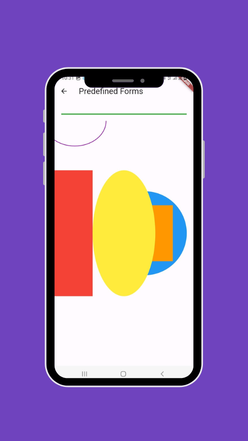
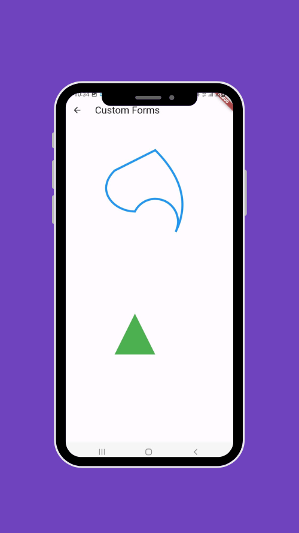
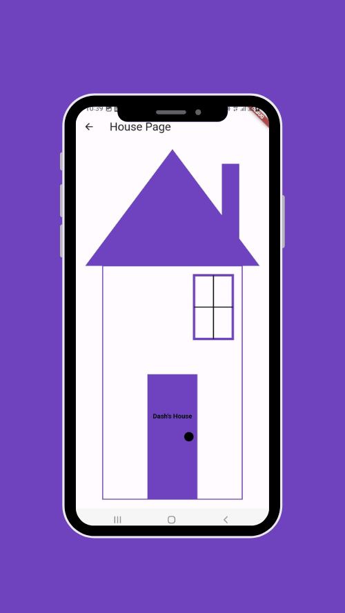
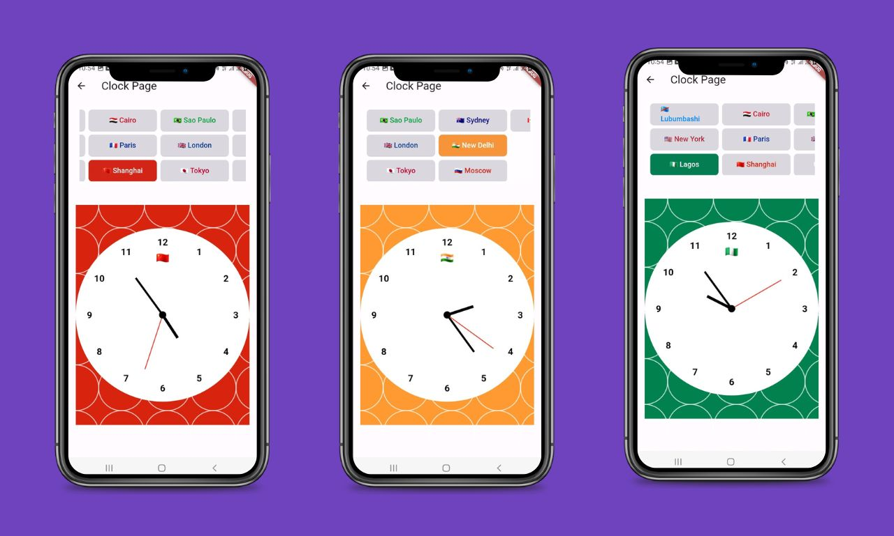

# Flutter custom painter

A demo manipulation on Flutter custom painter.

The CustomPainter class allows you to draw custom graphic elements, whether simple or complex.

It's often used when you want to create elements that you can't get with standard Flutter widgets.

## Predefined shapes

## Custom shapes

## Example

### House

### World clock

## Final Demo

## Tutorial

To learn how to create this application, you can follow this tutorial:

🇬🇧 🇺🇸 [Flutter and Dart: Unleash the Picasso within you with CustomPainter](https://lyabs.hashnode.dev/flutter-and-dart-unleash-the-picasso-within-you-with-custompainter)

🇫🇷 [Flutter et Dart: Révélez le Picasso qui est en vous avec le Custom Painter](https://medium.com/@loicyabili/flutter-et-dart-r%C3%A9v%C3%A9lez-le-picasso-qui-est-en-vous-avec-le-custom-painter-d30b86bb77ef)
